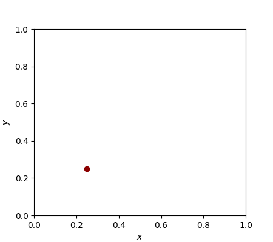

# `rhmc-jax`: A JAX package for Reflection Hamiltonian Monte Carlo (RHMC)
`rhmc-jax` is a JAX implementation of Reflection HMC based on the paper [Reflection, Refraction, and Hamiltonian Monte Carlo](https://papers.nips.cc/paper_files/paper/2015/hash/8303a79b1e19a194f1875981be5bdb6f-Abstract.html).

Although HMC is usually performed on infinite support, specific settings exist where the distribution of interest is defined on a constrained space. While a transformation such as a sigmoid or tanh can be applied to map the limited support to unconstrained intervals in most cases, this is not high energy physics (HEP). The reason for this is that divergences in the distribution can appear at the boundary which would lead to non-zero probability mass at $+\infty$ or $-\infty.$

In order to perform HMC on HEP distributions, HMC has to be performed on the unit hypercube of arbitary dimension. If standard HMC is used, chains need to be rejected that land outside the defined support which results in a decreased acceptance rate. Employing reflection at the boundaries of the unit hypercube can mitigate this problem and increase the efficiency. 

The modified version of HMC is called Reflection HMC (RHMC) and it is based on the paper [Reflection, Refraction, and Hamiltonian Monte Carlo](https://papers.nips.cc/paper_files/paper/2015/hash/8303a79b1e19a194f1875981be5bdb6f-Abstract.html). 
This package is built on and extends the HMC implementation of [blackjax](https://blackjax-devs.github.io/blackjax/) to include reflection.

## Installation
The `rhmc-jax` package can be installed in its own environment via the following steps: Firstly, clone the repository in its intended folder by executing
```
git clone https://github.com/annalena-k/rhmc-jax.git
```
Next, create a virtual environement via, e.g.,
```
python3 -m venv rhmc-venv
```
To activate the environment with the name `rhmc-venv`, execute
```
source rhmc-venv/bin/activate
```
Now, we enter the new repository
```
cd rhmc-jax
```
and install the package in editable mode using

```
pip install -e .
```
This will automatically install all dependenies listed in `requirements.txt`.
If you want to install the requirements separately, use
```
pip install -r requirements.txt
```

## Usage
Since `rhmc-jax` extends the HMC implementation of [`blackjax`](https://blackjax-devs.github.io/blackjax/) to RHMC, its usage is equivalent to `blackjax` and the original [documentation](https://blackjax.readthedocs.io/en/latest/) might be helpful.
To illustrate the use of `rhmc-jax`, several examples are provided which will be introduced in the following.

## Examples
The `/examples/` directory contains several use cases of `blackjax` and `rhmc-jax`.

- The notebook `hmc_2d_gaussians.ipynb` introduces the standard distribution of Gaussians located on a circle and shows how HMC is performed with `blackjax`.
- The noteook `rhmc_2d_gaussians.ipynb` illustrates how the acceptance rate of HMC decreases if this distribution is restricted to the unit square. This motivates the use of RHMC and a direct comparison shows that including reflection improves the acceptance rate to approximately 99 %. 
- The file `reflection_algorithm_in_detail.pynb` introduces and visualizes details of the reflection algorithm employed in this package. It includes code for visualizing subsequent reflections at the boundary of the unit square.


Since employing RHMC is motivated by the use case of HEP matrix elements, we showcase RHMC with a complex HEP distribution:
- The 3-body decay $\Lambda_c^+ \rightarrow pK^- \pi^+$ is based on [this publication](https://doi.org/10.1007/JHEP07(2023)228) and the implementation depends on the publicly available [code](https://doi.org/10.5281/zenodo.7544989). The matrix element is defined on the 2D phasespace and can be visualized in a Dalitz plot. It has a complex structure resulting from multiple resonances in the different decay channels and their interference. The notebook `rhmc_2d_Lc2pKpi.ipynb` shows how the Dalitz plot can be transformed to the unit square and provides RHMC results for this challenging distribution.

