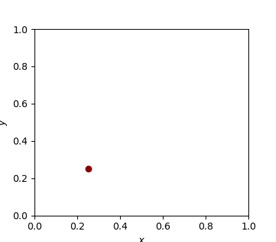

# `rhmc-jax`: A JAX package for Reflection Hamiltonian Monte Carlo (RHMC)
`rhmc-jax` is a JAX implementation of Reflection HMC based on the paper [Reflection, Refraction, and Hamiltonian Monte Carlo](https://papers.nips.cc/paper_files/paper/2015/hash/8303a79b1e19a194f1875981be5bdb6f-Abstract.html).

Although HMC is usually performed on infinite support, specific settings exist where the distribution of interest is defined on a constrained space. While a transformation such as a sigmoid or tanh can be applied to map the limited support to unconstrained intervals in most cases, this is not high energy physics (HEP). The reason for this is that divergences in the distribution can appear at the boundary which would lead to non-zero probability mass at $+\infty$ or $-\infty.$

In order to perform HMC on HEP distributions, HMC has to be performed on the unit hypercube of arbitary dimension. If standard HMC is performed, chains need to be rejected that land outside the defined support which results in a decreased acceptance rate. Employing reflection at the boundaries of the unit hypercube this problem can be mitigated and the efficiency can be increased. 

The modified version of HMC is called Reflection HMC (RHMC) and it is based on the paper [Reflection, Refraction, and Hamiltonian Monte Carlo](https://papers.nips.cc/paper_files/paper/2015/hash/8303a79b1e19a194f1875981be5bdb6f-Abstract.html). 

This package is built on and extends the HMC implementation of [blackjax](https://blackjax-devs.github.io/blackjax/) to include reflection.
